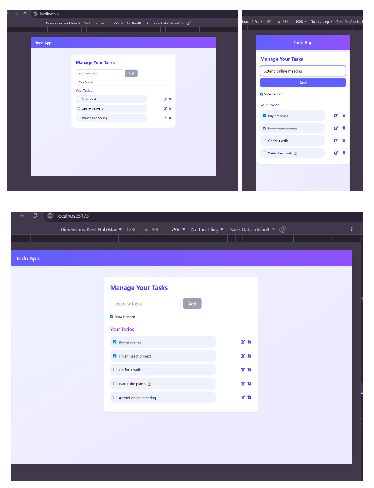

# Todo App (React + Tailwind CSS)

A modern, clean, and responsive Todo List application built using React and Tailwind CSS.  
The app allows users to manage daily tasks efficiently with full localStorage persistence, ensuring that todos remain saved even after refreshing the page.

---

## Features

- Add new todos
- Edit existing todos
- Delete todos permanently
- Mark todos as completed with strike through
- Persistent storage using browser localStorage
- Clean UI
- Fully responsive design
- Reusable Navbar component

---

## Tech Stack

- React (Vite)
- Tailwind CSS
- React Icons
- UUID
- localStorage API

---

## Preview

## How Data Persistence Works

- Todos are saved in the browser's localStorage

- On application load, saved todos are restored

- Completed and deleted todos remain unchanged after refresh

## Project Structure
src/

│── components/

│   └── Navbar.jsx

│── App.jsx

│── main.jsx

│── index.css

## Author

**Ankita**

Linkedin: www.linkedin.com/in/ankita-gupta004 

Github: github.com/ankita-gupta83